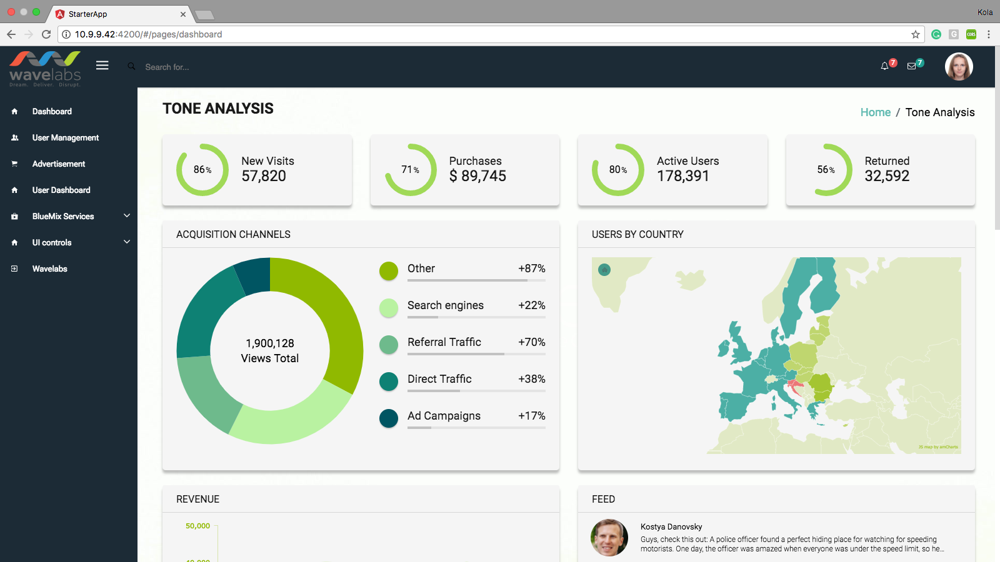

Starter App using Angular2
--------------------------

PreRequisite
------------
NodeJs(> 6.9.x) is required to run this project.

Type in command line `node -v` to check the existing version.

Otherwise download the stable version from https://nodejs.org/en/download/ 

Npm Global packages needed
--------------------------
Run this in command line to install global npm packages.

npm install --global webpack webpack-dev-server typescript@2.1.5 @angular/cli

Install dependencies
--------------------
Checkout the folder from git repo.

cd idn-app-angular2

npm install

To start server
---------------
ng serve

Open the dev url in browser: http://localhost:4200

Demo
-----
[Demo](http://angular2.app.nbos.io/#/home)

How to add Module
-----------------
[Add New module](https://docs.google.com/document/d/1Wu7IxqINP3S_Lqt5Q_Vlu3Mr2rw2ti1LP9YHsVY4CDo/edit)
